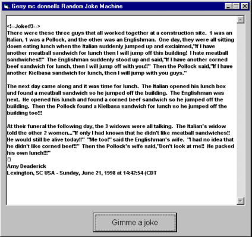



## gerrys joke machine 0\.1

### Description

shows jokes over 250 on file. very basic code needs work to make it into something cool. some very good jokes. taken from the jokepost.com's screensaver.
 
### More Info
 

             |
---                |---
**Submitted On**   |2001-03-05 23:17:38
**By**             |[irish\_bloke](https://github.com/Planet-Source-Code/PSCIndex/blob/master/ByAuthor/irish-bloke.md)
**Level**          |Beginner
**User Rating**    |5.0 (10 globes from 2 users)
**Compatibility**  |VB 4\.0 \(16\-bit\), VB 4\.0 \(32\-bit\), VB 5\.0, VB 6\.0
**Category**       |[Jokes/ Humor](https://github.com/Planet-Source-Code/PSCIndex/blob/master/ByCategory/jokes-humor__1-40.md)
**World**          |[Visual Basic](https://github.com/Planet-Source-Code/PSCIndex/blob/master/ByWorld/visual-basic.md)
**Archive File**   |[CODE\_UPLOAD16097362001\.zip](https://github.com/Planet-Source-Code/irish-bloke-gerrys-joke-machine-0-1__1-21553/archive/master.zip)

